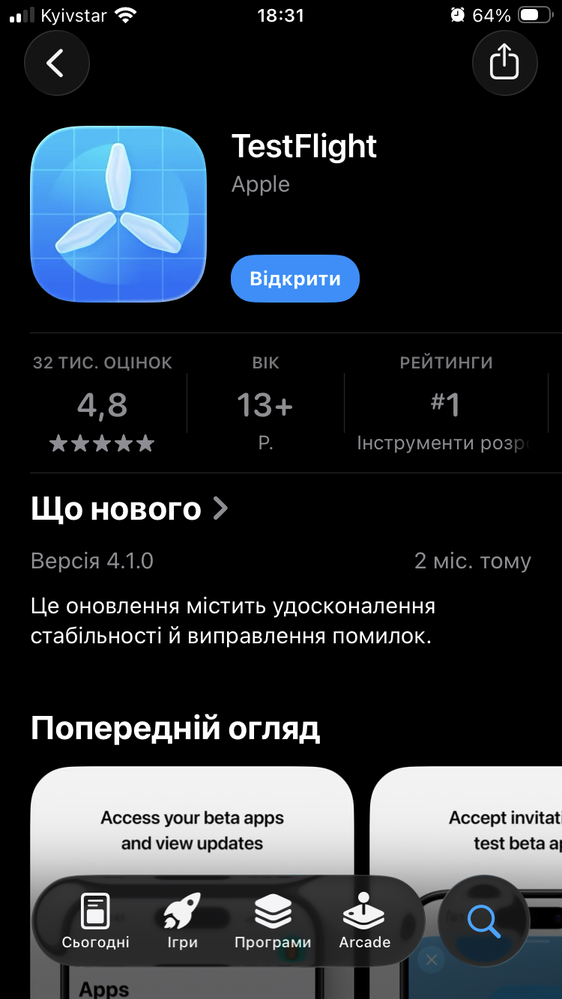
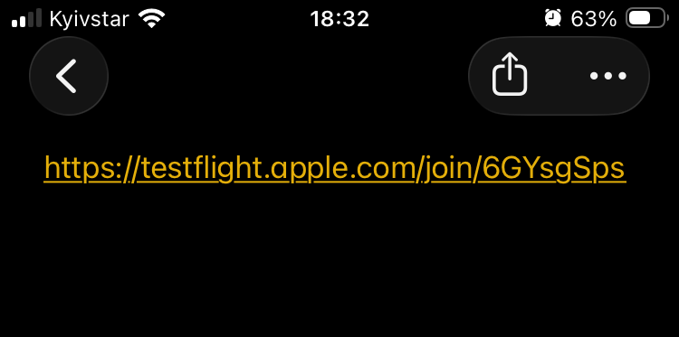
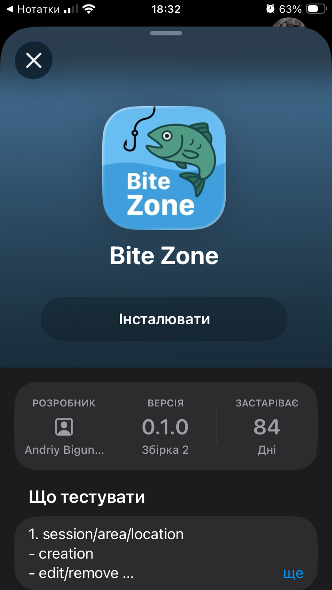

# Тестування 🇺🇦

Для того щоб почати тестувати додаток Bite Zone, вам потрібно виконати 2 прості кроки:


## 1.Встановлення TestFlight
 
**TestFlight** - офіційний додаток Apple для тестування бета-версій, які ще не доступні в App Store. Він дозволяє завантажувати та встановлювати бета-версії додатків, а також надавати зворотний зв'язок розробникам.
Знайдіть TestFlight в App Store та встановіть його на свій iOS-пристрій.




## 2. Перехід за посиланням
Відкрити на своєму iOS-пристрої публічне посилання на тестову версію додатку, яку ви отримали від розробника. В результаті ви будете перенаправлені до TestFlight, де з'явиться вікно з інформацією про додаток Bite Zone.




## 3. Інсталяція Bite Zone 
Після переходу за посиланням в додатку TestFlight з'явиться вікно програми Bite Zone, де потрібно натиснути кнопку «Інсталювати». Також варто звернути увагу на розділ «Що тестувати», де вказана додаткова інформація від розробника.




## 4. Як повідомити про баг

Якщо ви виявили помилку або несправність, ось як правильно повідомити про баг:

### Використання TestFlight для звітування

1. Відкрийте додаток **TestFlight**
2. Знайдіть додаток **Bite Zone** у списку
3. Натисніть кнопку **«Надіслати відгук»** (Send Feedback)
4. Опишіть проблему, яку ви виявили

### Що вказати у звіті про баг

Щоб розробники могли швидко відтворити та виправити проблему, будь ласка, вкажіть наступну інформацію:

#### Обов'язкова інформація:
- **Заголовок**: Коротко опишіть проблему (наприклад: "Додаток вилітає при запуску 3-го таймера")
- **Кроки для відтворення**: Детально опишіть, що саме ви робили перед появою помилки
- **Очікуваний результат**: Що має відбутися в нормальній ситуації
- **Фактичний результат**: Що відбулося насправді (помилка, вилітання, некоректне відображення тощо)

#### Додаткова корисна інформація:
- **Модель пристрою**: (наприклад: iPhone 14 Pro, iPad Air)
- **Версія iOS**: (наприклад: iOS 26.1.0)
- **Версія додатку**: (вказана в TestFlight)
- **Скріншоти або відео**: Прикріпіть зображення або запис екрану, якщо це можливо
- **Частота появи**: Чи трапляється помилка завжди, або інколи
- **Додаткові умови**: Чи впливає інтернет-з'єднання, час доби, завантаженість додатку тощо

### Приклад хорошого звіту про баг

```
Заголовок: Додаток зависає при спробі оплатити замовлення

Кроки для відтворення:
1. Відкрити додаток Bite Zone
2. Перейти в табу "Таймер"
3. Вибрати кількість таймерів - 3 
4. Запустити перші два таймери
5. Запустити третій таймер - додаток вилітає

Очікуваний результат: 
Всі три таймери запускаються без проблем, додаток працює стабільно.

Фактичний результат:
Після запуску третього таймера додаток і вилітає.

Додаткова інформація:
- Модель: iPhone 14 Pro Max
- iOS: 26.1.1
- Версія додатку: 0.1.2 (Build 45)
- Частота: Трапляється щоразу
```

### Альтернативні способи зв'язку

Якщо ви не можете скористатися TestFlight, зв'яжіться з командою розробки через:
- **Email**: biguniakDev@gmail.com
- **Telegram**: [BiteZoneGroup](t.me/BiteZoneGroup) в гілці `Баги`
- **Форма зворотного зв'язку**: У налаштуваннях додатку

### Конфіденційність

Ваші дані та відгуки обробляються конфіденційно і використовуються виключно для покращення якості додатку.

---

**Дякуємо за ваш внесок у покращення Bite Zone! 🎉**

Ваші звіти допомагають зробити додаток кращим для всіх користувачів.


